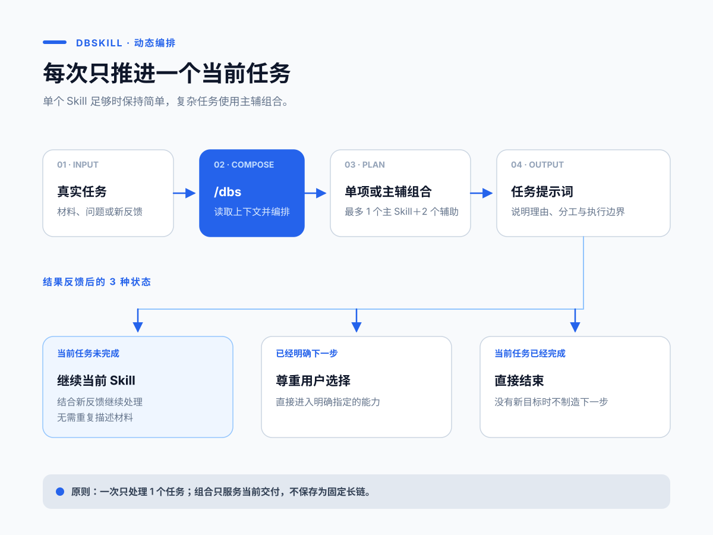
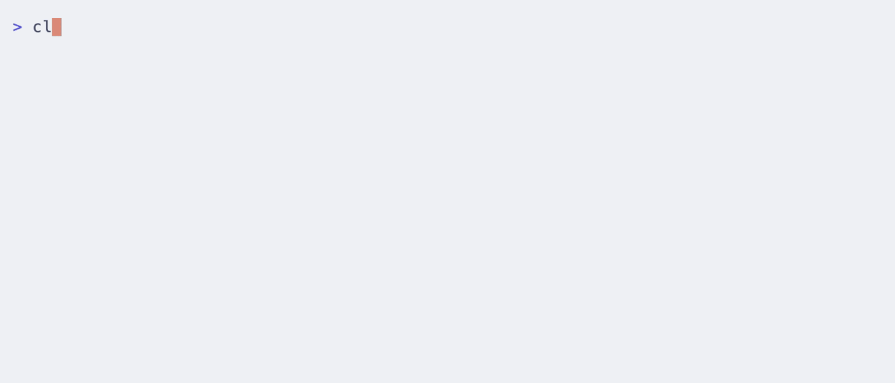
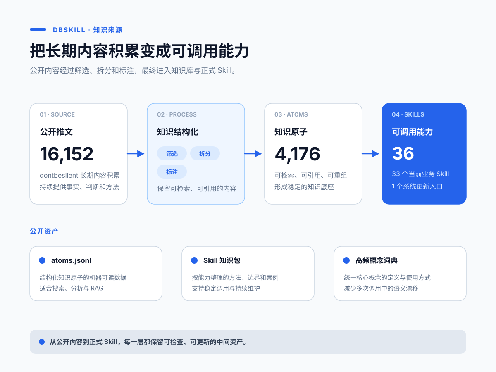

# dbskill

[简体中文](README.md) | [English](README.en.md) | 日本語 | [한국어](README.ko.md) | [繁體中文](README.zh-TW.md)

> 起業家とコンテンツ制作者のための中国語 AI Skills ツールキット。ビジネス、コンテンツ、実行に関する現実の課題を Agent に渡し、明確な判断と次の具体的な行動を得られます。

[](VERSION)
[](docs/新手入门.md#skill-全目录)
[](LICENSE)

**豆包、WorkBuddy、Claude Code、Codex、および Skills に対応する他の Agent で利用できます。**

dbskill は [dontbesilent](https://x.com/dontbesilent) が作成しました。公開投稿 16,152 件から整理した 4,176 件の知識原子を含み、現行の業務 Skill 33 個、旧版互換エントリ 2 個、更新エントリ 1 個を提供します。

**今回の更新：** 動画のチャプターナビゲーションと進捗バーを含む MP4 を生成できます。動画データ抽出、タイトル・冒頭作成、ナビゲーション制作の役割も明確にしました。

[クイックスタート](#クイックスタート) · [インストール](#インストール) · [機能](#機能一覧) · [完全ガイド](docs/新手入门.md) · [変更履歴](https://github.com/dontbesilent2025/dbskill/commits/main)



## dbskill が解決する課題

複雑な方法論を先に学ぶ必要はありません。どのツールを呼び出すかも覚えなくて大丈夫です。現在のビジネス状況、素材、選択、行き詰まりを `/dbs` に渡すと、1 つの Skill で十分かを判断し、複雑なタスクでは主 Skill 1 つと補助 Skill 最大 2 つを編成します。

| 状況 | 得られるもの |
| --- | --- |
| 顧客が高いと言う | ビジネス診断、リスク、検証アクション |
| テーマはあるが視聴されるコンテンツにできない | 方向性、冒頭、タイトル、台本の改善 |
| やるべきことは分かるが進められない | 停滞要因の分析と着手できる行動 |
| 同じ判断を繰り返し、経験が蓄積しない | 意思決定記録、パターン、スナップショット |
| 原稿やテーマ、事例が散らばっている | 維持可能なコンテンツ資産プロジェクト |

## クイックスタート

インストール後、Agent に入力します。

```text
/dbs 子ども向けプログラミング教室を運営しています。40 人の有料生徒がいますが、継続率が低いです。
問題が商品、価格、顧客層のどこにあるか判断したいです。
```

`/dbs` は会話の情報を読み、選択理由を説明して、そのまま送信できるタスクプロンプトを生成します。1 回終えた後に新しい事実やフィードバックを追加し、再度 `/dbs` を入力すると現在のタスクを再判断します。

動画に 3 桁の番号がある場合は、`/dbs 隠しスキルをすべて見せて` で公開済みの番号を確認し、`/dbs <番号>` で対応する方法を始められます。内容は利用時に GitHub から取得するため、GitHub への接続が必要です。新しい番号が追加されても dbskill の再更新は不要です。番号が未公開なら空と表示されます。

目的が明確な場合は、Skill を直接呼び出せます。

```text
/dbs-diagnosis 子育て中の母親向けに片付けコンサルをしています。高いと言われます。何を変えるべきですか？
/dbs-content 「普通の人はパーソナルブランド作りを急がない方がよい」という話を、どうコンテンツにしますか？
/dbs-title-cover-intro 動画台本の最初の 20 秒です。冒頭を改善してください：……
/dbs-benchmark 法人向けサービスのコンテンツアカウントを研究したいです。どのベンチマークを調べるべきですか？
```

## 機能一覧

| 目的 | 主な Skill | 主な出力 |
| --- | --- | --- |
| ビジネス、商品、価格、顧客を判断する | `/dbs-diagnosis` | 診断、リスク、検証計画 |
| 研究対象を探す | `/dbs-benchmark` | 対象リストと研究フレーム |
| 経験的な主張を検証し、信頼できる理論で根拠づける | `/dbs-theory-grounding` | 命題の修正、理論アンカー、事例の再解釈、適用範囲 |
| 関連分野と理論を調べ、歴史的な同型事例を比較する | `/dbs-standard-answer` | 理論アンカー、事例マトリクス、条件付きの答え、失敗条件 |
| テーマ、コンテンツ、タイトル、動画を作る | `/dbs-content`、`/dbs-title-cover-intro` | 方向性と公開用原稿 |
| ショート動画のデータと音声文字起こしを取得する | `/dbs-video-extract` | 作品／アカウントデータと、作者・タイトル別の Markdown 文字起こし |
| 動画にチャプター・話題・手順の案内を付ける | `/dbs-video-navigation` | 独立した MP4、進捗バー、時間表、配置説明 |
| コンテンツ全体の対象者・流入・商業的価値を評価 | `/dbs-content-value` | 全体評価、根拠、改善の優先順位 |
| 公開前にコンテンツリスクを確認する | `/dbs-content-risk-check` | 自動審査のシグナル、内容上の問題、最小限の修正 |
| 共感、論理、拡散性を確認する | `/dbs-resonate`、`/dbs-script-flow`、`/dbs-spread` | 優先順位付きの修正案 |
| 概念、目標、問いを明確にする | `/dbs-deconstruct`、`/dbs-goal`、`/dbs-good-question` | 検証可能な定義と目標 |
| 先延ばしや実行の停滞を扱う | `/dbs-action` | 停滞分析と次の行動 |
| 長期の意思決定を記録・振り返る | `/dbs-decision`、`/dbs-save`、`/dbs-restore`、`/dbs-report` | ローカルの記録とレポート |
| コンテンツ資産と複数 Agent の環境を構築する | `/dbs-content-system`、`/dbs-agent-migration`、`/dbs-install-skill` | ローカルプロジェクトとインストール計画 |
| ローカルフォルダをナレッジベースにする | `/dbs-knowledge` | ナビゲーション、バージョン規則、すぐ使える質問例 |
| 繰り返す作業を Skill にする | `/dbs-skill-maker` | インストール可能な Skill、検証結果、任意の公開準備 |

現在の機能、入力例、役割の違いは [完全ガイドと Skill 一覧](docs/新手入门.md#skill-全目录) を参照してください。

### 動画ナビゲーション

```text
/dbs-video-navigation このローカル動画にチャプター案内と進捗バーを作ってください。
```

ローカル動画またはタイムスタンプ付き SRT を渡してください。字幕のみの場合は最終画面サイズ、フレームレート、動画の総時間も必要です。出力は編集ソフトに読み込める黒背景の独立 MP4 です。原動画の編集や公開は自動では行いません。Agent が内容に合わせて章・話題・手順を選び、配置と時間を確認します。Python、FFmpeg/ffprobe、対応フォントが必要です。macOS は Swift/AppKit、その他の環境は Pillow と指定フォントを使えます。動画だけの場合は文字起こし機能も必要で、クラウド利用時はサービスとアップロード範囲を事前に説明します。中国語の講義動画で制作を検証済みですが、他の種類は体系的な評価を行っていません。

タイトル、表紙の文字、動画の冒頭には `/dbs-title-cover-intro` を使用します。`/dbs-hook` と `/dbs-xhs-title` は旧版の明示的な呼び出しや比較用に残しています。

## インストール

### 推奨：Claude Code、豆包、WorkBuddy、Codex、その他 Skills 対応 Agent

ターミナルで実行します。

```bash
npx -y skills add dontbesilent2025/dbskill -g --all
```

Agent に戻り、`/dbs 新手入门` と入力して始めてください。

### Claude Code マーケットプレイス

Claude Code マーケットプレイスから完全なツールキットをインストールすることもできます。

```bash
claude plugin marketplace add dontbesilent2025/dbskill
claude plugin install dbs@dontbesilent-skills
```

`dbs` プラグインには現行の業務 Skill 33 個、旧版互換エントリ 2 個、更新用の `dbs-update` が含まれます。Claude Code ではメイン入口に `/dbs:dbs`、個別機能に `/dbs:dbs-diagnosis` などを使用します。

機能を 1 つだけインストールする場合は、対応するプラグインを選択します。例：`claude plugin install dbs-diagnosis@dontbesilent-skills`



### 更新

現在の Agent に次のように伝えます。

```text
更新 dbskill
```

公式 dbskill を同期します。`~/.dbs/` 内の記録、レポート、意思決定データは変更しません。変更内容は [コミット履歴](https://github.com/dontbesilent2025/dbskill/commits/main) を参照してください。

## 仕組み

```text
現実のタスク
   ↓
/dbs が文脈を読み、単一 Skill または主補助編成を判断
   ↓
そのまま送信できるタスクプロンプトを生成
   ↓
選ばれた Skill が 1 つの統合結果を納品
   ↓
結果とフィードバックを追加し、現在のタスクを再判断
```

## ナレッジベースとローカル記録

このリポジトリには 4,176 件の構造化知識原子、Skill 別の方法論ドキュメント、頻出概念の用語集が含まれます。

- データ範囲と項目は [原子ライブラリのガイド](知识库/原子库/README.md) を参照してください。
- 独自の RAG には `知识库/原子库/atoms.jsonl` を使用できます。
- 方法論は [Skill ナレッジパック](知识库/Skill知识包) で確認できます。
- 会話をまたいで作業を続けるには `/dbs-save`、`/dbs-restore`、`/dbs-report` を使用します。データは `~/.dbs/` にローカル保存されます。



## 作者とサポート

作者：[@dontbesilent](https://x.com/dontbesilent) · [小紅書](https://xhslink.com/m/637xuspR4iI) · [抖音](https://v.douyin.com/pRUDhpBqOrc/)

有料 Q&A サポートは、QR コードを読み取るか、[グループの案内](https://mp.weixin.qq.com/s/RpwNjMo4M_er4GOrfCYt1g) をご覧ください。


## ライセンス

[CC BY-NC 4.0](LICENSE) を採用しています。

- 個人利用、学習、研究、非商用プロジェクトで利用できます。
- 派生作品を公開する際は、出典を明記してください。
- 商用利用には別途許可が必要です。作者へ連絡してください。
